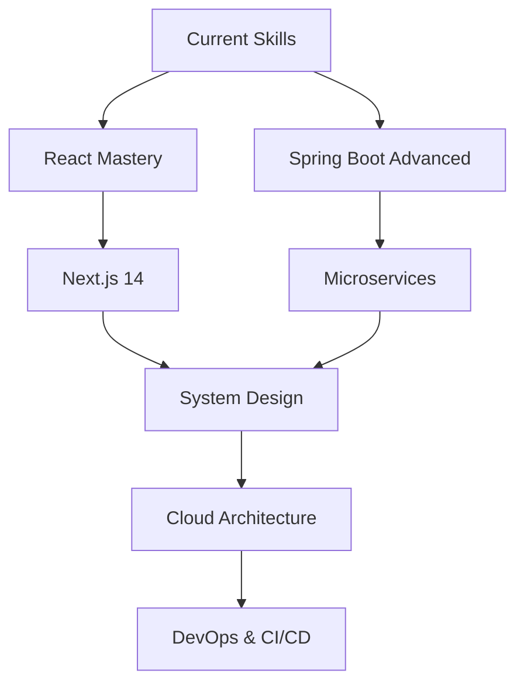

<div align="center">
  
</div>

<div align="center">
  
</div>

<div align="center">
  <a href="https://github.com/a-man-sheikh">
    
  </a>
  <a href="https://github.com/a-man-sheikh?tab=followers">
    
  </a>
  <a href="https://github.com/a-man-sheikh?tab=repositories">
    
  </a>
</div>


## 🚀 About Me

<div align="center">
  <table>
    <tr>
      <td align="center">
        
      </td>
      <td align="left">
        <h3>💫 Professional Summary</h3>
        <p>
          🎯 <strong>Passionate Full Stack Developer</strong> with expertise in modern web technologies<br>
          🌱 Currently mastering <strong>React ecosystem</strong> and <strong>Spring Boot microservices</strong><br>
          🔥 <strong>3+ years</strong> of hands-on development experience<br>
          🌍 Based in <strong>Ujjain, India</strong><br>
          💡 Love turning complex problems into <strong>simple, elegant solutions</strong><br>
          🎬 Movie buff & 📚 Book enthusiast in my free time
        </p>
      </td>
    </tr>
  </table>
</div>

```yaml
name: Aman Sheikh
role: Full Stack Developer
company: Available for opportunities
location: Ujjain, India
contact: sheikhaman0321@gmail.com

skills:
  frontend: [JavaScript, React, Next.js, HTML5, CSS3, TailwindCSS]
  backend: [Node.js, Express, Spring Boot, Java]
  database: [MongoDB, MySQL]
  tools: [Git, Linux, VS Code]
  
currently_learning: [React 18, Spring Boot 3, System Design, Docker]
interests: [Web Development, Open Source, Movies, Books]
available_for: [Full-time, Freelance, Collaboration]
```


## 🛠️ Technology Arsenal

<div align="center">
  
### Frontend Technologies
<div>
  
</div>

### Backend Technologies
<div>
  
</div>

### Databases & Tools
<div>
  
</div>

### Languages & Frameworks
<div>
  
</div>

</div>

<div align="center">
  
### 📊 Skill Proficiency

| Technology | Proficiency | Experience |
|------------|-------------|------------|
| JavaScript | ████████████████████ 95% | 3+ years |
| React | ████████████████████ 90% | 2+ years |
| Node.js | ████████████████████ 85% | 2+ years |
| Java | ████████████████████ 80% | 2+ years |
| Spring Boot | ███████████████████ 75% | 1+ year |
| MongoDB | ████████████████████ 85% | 2+ years |
| MySQL | ████████████████████ 80% | 2+ years |

</div>


## 📈 GitHub Analytics & Performance

<div align="center">
  
  
</div>

<div align="center">
  
</div>

### 📊 Detailed GitHub Metrics

<div align="center">
  
</div>

<div align="center">
  
  
</div>

<div align="center">
  
  
</div>

### 📈 Contribution Activity

<div align="center">
  
</div>


## 🏆 Achievements & Recognition

<div align="center">
  
</div>

<div align="center">
  
### 🎯 Key Achievements
  
| Achievement | Status | Year |
|-------------|--------|------|
| 🚀 First Open Source Contribution | ✅ Completed | 2023 |
| 💻 25+ GitHub Repositories | ✅ Completed | 2024 |
| 📈 100+ GitHub Stars | ✅ Completed | 2024 |
| 🎓 React Certification | 🔄 In Progress | 2025 |
| ☁️ AWS Cloud Practitioner | 📝 Planned | 2025 |

</div>


## 🎯 Current Focus & Goals

<div align="center">
  <table>
    <tr>
      <td align="center" width="50%">
        <h3>🚀 Currently Working On</h3>
        <ul align="left">
          <li>🔥 Building modern web apps with <strong>React 18</strong></li>
          <li>⚡ Developing APIs with <strong>Spring Boot 3 & Express</strong></li>
          <li>🌐 Creating responsive UI with <strong>TailwindCSS</strong></li>
          <li>📱 Exploring <strong>React Native</strong> for mobile</li>
          <li>🔧 Learning <strong>Docker</strong> & <strong>Kubernetes</strong></li>
        </ul>
      </td>
      <td align="center" width="50%">
        <h3>🎯 2025 Goals</h3>
        <ul align="left">
          <li>🏆 Master <strong>System Design</strong> principles</li>
          <li>☁️ Get <strong>AWS</strong> certified</li>
          <li>🤝 Contribute to <strong>10+ open source</strong> projects</li>
          <li>📝 Write <strong>technical blogs</strong> regularly</li>
          <li>🎤 Give a <strong>tech talk</strong> at a conference</li>
        </ul>
      </td>
    </tr>
  </table>
</div>

### 📚 Learning Path

<div align="center">
  


</div>


## 🌐 Professional Network

<div align="center">
  <table>
    <tr>
      <td align="center">
        <a href="https://linkedin.com/in/a-mansheikh">
          
        </a>
      </td>
      <td align="center">
        <a href="https://github.com/a-man-sheikh">
          
        </a>
      </td>
      <td align="center">
        <a href="https://x.com/a_man_sheikh">
          
        </a>
      </td>
    </tr>
    <tr>
      <td align="center">
        <a href="https://medium.com/@a_man_sheikh">
          
        </a>
      </td>
      <td align="center">
        <a href="mailto:sheikhaman0321@gmail.com">
          
        </a>
      </td>
      <td align="center">
        <a href="https://wa.me/+919876543210">
          
        </a>
      </td>
    </tr>
  </table>
</div>

### 📧 Contact Information

<div align="center">
  
| Platform | Handle | Purpose |
|----------|--------|---------|
| 📧 Email | sheikhaman0321@gmail.com | Professional inquiries |
| 💼 LinkedIn | @a-mansheikh | Networking & opportunities |
| 🐙 GitHub | @a-man-sheikh | Code repositories |
| 🐦 Twitter | @a_man_sheikh | Tech discussions |
| 📝 Medium | @a_man_sheikh | Technical writing |

</div>


## 💼 Work Experience & Projects

<div align="center">
  
### 🏢 Professional Experience
  
| Role | Company | Duration | Key Technologies |
|------|---------|----------|------------------|
| 🚀 Full Stack Developer | Freelance | 2024 - Present | React, Node.js, MongoDB, Express, |
| 💻 Web Developer | Self-employed | 2022 - 2024 | JavaScript, HTML, CSS |
| 🎓 Computer Science Student | University | 2022 - 2024 | Java, C/C++, Data Structures |

### 🎯 Featured Projects

</div>

<div align="center">
  <a href="https://github.com/a-man-sheikh/project-1">
    
  </a>
  <a href="https://github.com/a-man-sheikh/project-2">
    
  </a>
</div>


## 📊 Development Statistics

<div align="center">
  
### ⏱️ Weekly Development Breakdown
  
<!--START_SECTION:waka-->
```text
JavaScript   15 hrs 30 mins  ████████████████████▓░░░   85.5%
Java         1 hr 45 mins    ██▓░░░░░░░░░░░░░░░░░░░░░░   9.7%
CSS          35 mins         ▓░░░░░░░░░░░░░░░░░░░░░░░░   3.2%
HTML         18 mins         ▓░░░░░░░░░░░░░░░░░░░░░░░░   1.7%
Other        8 mins          ░░░░░░░░░░░░░░░░░░░░░░░░░   0.8%
```
<!--END_SECTION:waka-->

### 📈 Coding Activity

</div>

<div align="center">
  
</div>


## 🎵 Currently Playing

<div align="center">
  
</div>

## 💡 Random Dev Quote

<div align="center">
  
</div>


## 🌟 Support My Work

<div align="center">
  
### 🤝 Show Your Support

If you find my work valuable, consider:
- ⭐ **Starring** my repositories
- 🍴 **Forking** projects you find interesting
- 📢 **Sharing** with your network
- 💬 **Providing feedback** on my projects

<a href="https://www.buymeacoffee.com/amansheikh">
  
</a>

</div>


## 🎯 Let's Connect & Collaborate

<div align="center">
  
### 🚀 Ready to Build Something Amazing?

I'm always excited to work on interesting projects and collaborate with fellow developers. Whether you have a project idea, need help with development, or just want to chat about technology, feel free to reach out!

**📧 Email:** sheikhaman0321@gmail.com  
**💼 LinkedIn:** [linkedin.com/in/a-mansheikh](https://linkedin.com/in/a-mansheikh)  
**🐙 GitHub:** [github.com/a-man-sheikh](https://github.com/a-man-sheikh)

### 💼 Open for Opportunities

- 🎯 **Full-time positions** in Web Development
- 🤝 **Freelance projects** and **consulting**
- 👥 **Open source collaborations**
- 📝 **Technical writing** opportunities
- 🎤 **Speaking engagements** at tech events

</div>

---

<div align="center">
  
</div>

<div align="center">
  
</div>

<!-- Snake Animation -->
<div align="center">
  <picture>
    <source media="(prefers-color-scheme: dark)" srcset="https://raw.githubusercontent.com/a-man-sheikh/a-man-sheikh/output/github-contribution-grid-snake-dark.svg">
    <source media="(prefers-color-scheme: light)" srcset="https://raw.githubusercontent.com/a-man-sheikh/a-man-snake/output/github-contribution-grid-snake.svg">
    
  </picture>
</div>

---

<div align="center">
  <h3>⭐ Don't forget to star my repositories if you find them useful!</h3>
</div>
